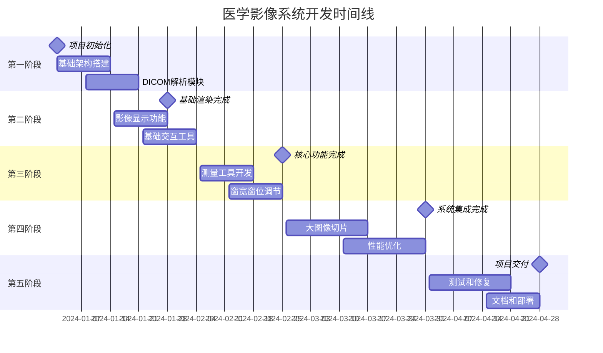

# 医学影像渲染处理系统开发路线图

## 1. 项目总体规划

### 1.1 开发周期
- **总开发周期**: 16周（4个月）
- **团队规模**: 3-4人（前端开发2人，全栈开发1人，测试1人）
- **开发模式**: 敏捷开发，2周一个迭代

### 1.2 里程碑概览


## 2. 详细开发计划

### 2.1 第一阶段：基础架构（第1-2周）

#### 里程碑1：项目初始化完成
**目标**: 搭建完整的开发环境和基础架构

**主要任务**:
- [x] 技术调研和方案设计
- [x] Vue 3项目初始化
- [x] TypeScript配置
- [x] Vite构建配置
- [x] ESLint和Prettier配置
- [x] 基础目录结构搭建

**交付物**:
- 可运行的Vue 3项目
- 完整的开发环境配置
- 代码规范和工作流

**验收标准**:
- 项目可以正常启动和构建
- 代码规范检查通过
- 基础路由和状态管理配置完成

#### 第1周具体任务
```
Day 1-2: 项目初始化
- 创建Vue 3 + TypeScript项目
- 配置Vite构建工具
- 集成Element Plus UI库

Day 3-4: 基础架构
- 配置Pinia状态管理
- 设置Vue Router路由
- 搭建基础组件结构

Day 5: 开发环境优化
- 配置ESLint和Prettier
- 设置Git hooks
- 编写开发文档
```

#### 第2周具体任务
```
Day 1-3: 医学影像库集成
- 集成Cornerstone.js
- 集成dcmjs DICOM解析库
- 创建基础的影像服务类

Day 4-5: 基础组件开发
- 开发影像查看器组件
- 开发工具栏组件
- 开发侧边栏组件
```

### 2.2 第二阶段：基础功能（第3-4周）

#### 里程碑2：基础渲染功能完成
**目标**: 实现DICOM文件的基本显示和交互

**主要任务**:
- [ ] DICOM文件解析和显示
- [ ] 基础的平移、缩放功能
- [ ] 文件上传和管理
- [ ] 基础的用户界面

**交付物**:
- 可以显示DICOM文件的查看器
- 基础的鼠标交互功能
- 文件管理界面

**验收标准**:
- 支持常见DICOM格式（CT、MR、X-Ray）
- 平移、缩放操作流畅
- 界面友好，操作直观

#### 第3周具体任务
```
Day 1-2: DICOM解析
- 实现DICOM文件解析
- 处理不同编码格式
- 错误处理和验证

Day 3-4: 影像显示
- 实现基础影像渲染
- 支持灰度图像显示
- 处理不同分辨率

Day 5: 文件管理
- 实现文件上传功能
- 文件列表显示
- 基础的文件信息展示
```

#### 第4周具体任务
```
Day 1-3: 交互功能
- 实现鼠标平移功能
- 实现滚轮缩放功能
- 添加重置视图功能

Day 4-5: 界面优化
- 完善用户界面
- 添加加载状态
- 错误提示和处理
```

### 2.3 第三阶段：核心功能（第5-6周）

#### 里程碑3：核心医学影像功能完成
**目标**: 实现医学影像查看器的核心功能

**主要任务**:
- [ ] 窗宽窗位调节
- [ ] 测量工具（长度、角度、面积）
- [ ] 影像标注功能
- [ ] 多帧影像播放

**交付物**:
- 完整的窗宽窗位调节功能
- 基础测量工具集
- 标注和播放功能

**验收标准**:
- 窗宽窗位调节实时响应
- 测量精度符合医学要求
- 多帧影像播放流畅

#### 第5周具体任务
```
Day 1-2: 窗宽窗位
- 实现窗宽窗位调节
- 添加预设窗宽窗位
- 实时调节响应

Day 3-4: 测量工具基础
- 实现长度测量工具
- 实现角度测量工具
- 测量结果显示

Day 5: 工具管理
- 工具切换机制
- 工具状态管理
- 快捷键支持
```

#### 第6周具体任务
```
Day 1-2: 高级测量
- 实现面积测量
- 实现椭圆测量
- 测量数据导出

Day 3-4: 标注功能
- 文本标注
- 箭头标注
- 标注管理

Day 5: 多帧播放
- 多帧影像检测
- 播放控制器
- 播放速度调节
```

### 2.4 第四阶段：高级功能（第7-8周）

#### 里程碑4：系统集成和优化完成
**目标**: 集成大图像处理和性能优化

**主要任务**:
- [ ] OpenSeadragon集成
- [ ] 大图像切片显示
- [ ] Web Workers优化
- [ ] 缓存机制实现

**交付物**:
- 大图像切片查看器
- 性能优化的渲染引擎
- 智能缓存系统

**验收标准**:
- 支持GB级大图像显示
- 渲染性能达到60FPS
- 内存使用优化

#### 第7周具体任务
```
Day 1-3: OpenSeadragon集成
- 集成OpenSeadragon库
- 实现瓦片图像显示
- 与Cornerstone.js协调

Day 4-5: 大图像处理
- 实现图像切片逻辑
- 瓦片缓存管理
- 动态加载优化
```

#### 第8周具体任务
```
Day 1-2: Web Workers
- 图像处理Worker
- DICOM解析Worker
- 数据传输优化

Day 3-5: 性能优化
- 渲染性能优化
- 内存管理优化
- 网络请求优化
```

### 2.5 第五阶段：测试和交付（第9-10周）

#### 里程碑5：项目交付
**目标**: 完成测试、文档和部署

**主要任务**:
- [ ] 单元测试和集成测试
- [ ] 性能测试和优化
- [ ] 用户文档编写
- [ ] 部署和发布

**交付物**:
- 完整的测试报告
- 用户使用文档
- 部署就绪的应用

**验收标准**:
- 测试覆盖率达到80%以上
- 性能指标达到预期
- 文档完整清晰

## 3. 风险管理和应对策略

### 3.1 技术风险
| 风险 | 概率 | 影响 | 应对策略 |
|------|------|------|----------|
| Cornerstone.js集成困难 | 中 | 高 | 提前技术验证，准备备选方案 |
| 大图像性能问题 | 高 | 中 | 分阶段实施，性能测试先行 |
| 浏览器兼容性问题 | 中 | 中 | 明确支持的浏览器范围 |

### 3.2 进度风险
| 风险 | 概率 | 影响 | 应对策略 |
|------|------|------|----------|
| 开发进度延迟 | 中 | 高 | 每周进度检查，及时调整 |
| 需求变更 | 高 | 中 | 需求冻结，变更控制流程 |
| 人员变动 | 低 | 高 | 知识文档化，交接计划 |

## 4. 质量保证计划

### 4.1 代码质量
- **代码审查**: 所有代码必须经过同行审查
- **自动化测试**: 单元测试覆盖率80%以上
- **静态分析**: ESLint规则严格执行
- **性能监控**: 关键路径性能测试

### 4.2 测试策略
- **单元测试**: Jest + Vue Test Utils
- **集成测试**: Cypress端到端测试
- **性能测试**: Lighthouse + 自定义性能指标
- **兼容性测试**: 主流浏览器测试

## 5. 交付标准

### 5.1 功能完整性
- ✅ DICOM文件解析和显示
- ✅ 基础交互操作（平移、缩放、旋转）
- ✅ 窗宽窗位调节
- ✅ 测量工具（长度、角度、面积）
- ✅ 多帧影像播放
- ✅ 大图像切片显示

### 5.2 性能指标
- **首屏加载时间**: < 3秒
- **DICOM文件解析**: < 2秒（10MB文件）
- **渲染帧率**: ≥ 30FPS
- **内存使用**: < 500MB（正常使用）

### 5.3 兼容性要求
- **浏览器支持**: Chrome 90+, Firefox 88+, Safari 14+, Edge 90+
- **设备支持**: 桌面端和平板设备
- **分辨率支持**: 1920x1080及以上

### 5.4 文档交付
- 技术架构文档
- API接口文档
- 用户使用手册
- 部署运维文档
- 开发者指南
